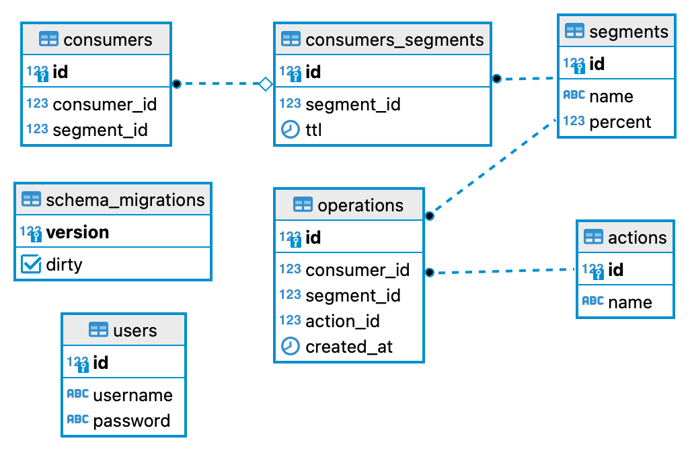

# Dynamic user segmentation

Микросервис для работы с сегментами пользователей. Возможность получать сегменты c ttl, к которым относится пользователь.
Также микросервис хранит всю историю действий совершенную над сегментами

## Используемые технологии

1. PostgreSQL - как хранилище данных. Драйвер (pgx)
2. Swagger - для документации API
3. Postman - для создания HTTP запросов
4. ECHO - фреймворк для развертывания контроллера
5. Docker - для создания контейнера
6. Docker-compose - инструмент для оркестрации контейнеров
7. golang-migrate/migrate - для миграции базы данных
8. golang/mock - создание моков для тестирования сервисов
9. pgxmock - создания моков для тестирования репозитория

``
Был реализован Graceful Shutdown для завершения работы сервиса
``

10. Также использовались JWT токены для авторизации

``
По умолчанию проект находится на ветке без авторизации. Если требуется поменять версию микросервиса для работы 
по авторизации, то надо переключиться на ветку проекта noauth
``

## Выполнено
Выполнение технического задания
- Добавление/удаление сегментов
- Добавление/удаление сегментов пользователю

`` 
Было принято решение, что лучше хранить для каждого пользователя его сегменты
в разных строках таблицы. Так при удалении или добавлении нового сегмента, не требуется
как-то брать значение сегментов пользователя, добавлять/удалять и заново записывать в базу данных
Вместо этого можно в зависимости от действия, добавить/удалить отдельную запись, у которой будет хранится
id клиента и внешний ключ на запись в другой таблице, где хранятся сегменты пользователей.
``
- Получение всех сегментов хранящиеся в базе данных.
- Получение всех актуальных сегментов конкретного пользователя

``
Для получения актуальной информации, была написана функция в базе данных, которая на вход получает id клиента
и удаляет все записи у которых expired ttl. Проверка, является ли expired ttl у сегмента, происходит в момент обращения, перед выдачей
всех сегментов конкретного пользователя.
``
- Автоматическое добавление сегментов пользователю при указании сегменту определенного %

``
У каждого сегмента есть поле в таблице, которое хранит какому числу людей нужно добавлять данный сегмент
То есть если указать 10, то получается что данный сегмент будет автоматически добавлять 
10, 20, 30, 40, ... . При создании нового пользователя, идет подсчет всех уникальных пользователей в таблице
и по данному количество уже функция считает, стоит ли выдавать тот или иной сегмент, в зависимсоти от процента.
``
- Обновление TTL для сегмента пользователя
- Хранение истории операций, которые были совершены над сегментами пользователя

``
Каждое действие над пользователем хранится в истории. Все доступные действия находятся в таблице. Можно их добавлять и удалять через json запросы
при расширении функционала микросервиса
``
- Получение истории операций

``
Передается в формате json или text/csv в теле запроса.
``

- Частичное покрытие тестами

``
Не хватило времени, чтобы полностью покрыть код тестами, сделано по 1-2 тесту для репозитория/сервиса/контроллера
``

### Диаграмма базы данны
База данных была нормализована. Нет связей many to many

Таблица *consumers*: содержит в себе id клиента и внешний ключ
на сегменты (consumers_segments.id), которые присвоены ему. 

Таблица *consumers_segments*: хранит сегменты которые добавлены пользователям
и также их ttl. 

Таблица *segments*: хранит название сегмента и процент

Таблица *actions*: хранит действия, которые могут быть записаны в истории операций

Таблица *operations*: история всех операций за определенный промежуток времени

Таблица *users*: используется для авторизации пользователей, если использются JWT токены

## Начало работы

Для запуска необходимо:
- Настроить .env файл в директорию с проектом. Заполнить как также, как представлен в этом проекте
- Настроить конфигурацию работы сервера в config/config.yaml

### Команды

- Запустить сервер: `make compose-up`
- Для запусков тестов: `make test`
- Для запусков тестов с покрытием: `make cover-html`
- Для запуска линтера: `make linter-golangci`
- Документация можно будет посмотреть `http://{host}:{port}/swagger/index.html`
- Запросы для сервиса *postman* можно найти в проекте по пути: `postman/AvitoBackend.postman_collection.json`

## Примеры
